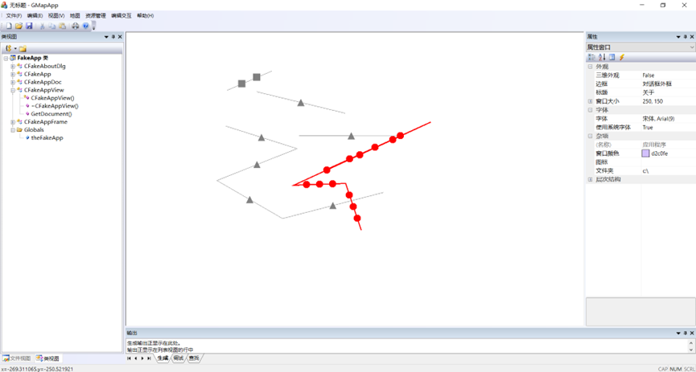
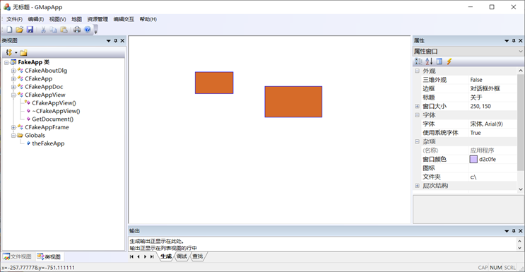
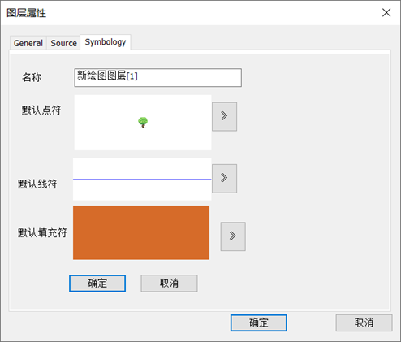

# GMAP

#### Introduction
Gmap System, a GIS Kerney system, in course of C++ and GIS Kernel Development, NNU, 2021

#### Background
A GIS kernel system, equipped with GIS major functions such as projection and coordinates, vector and raster map rendering, symbolization, files and database management. 

My job is to add some functions to this system such geometry graphics drawing, projections and coordinated conversion, customized symbols and attribute layers using C/C++ and MFC.

### System demo

